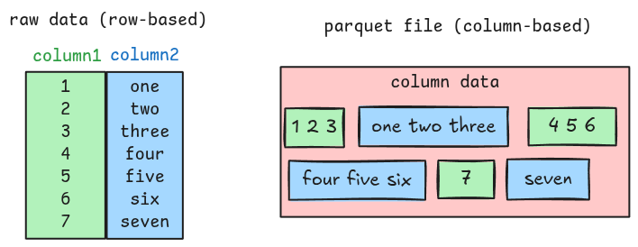
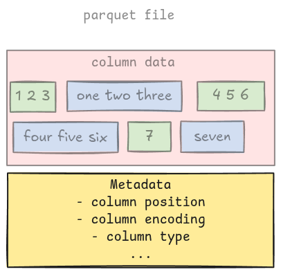
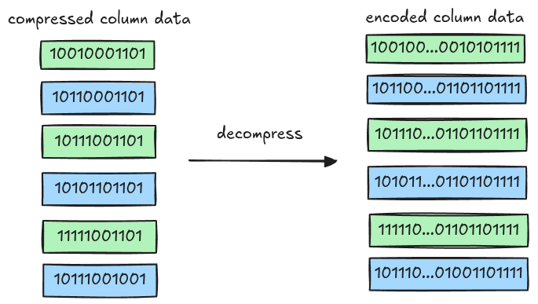
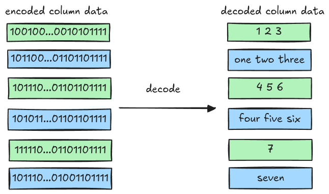
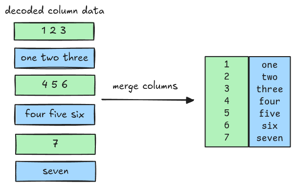

# Overview

This section describes a high level overview of parquet and what we will do (roughly) to parse it.

## Parquet File Format

Parquet is a columnar file format, unlike traditional row-based formats, parquet stores column data
close together.



Along with the actual column data, a parquet file also contains metadata such as column position,
column type, encoding, etc. These provide enough information so that a parquet parser can extract
out all the column data.



Parsing a parquet file is pretty straightforward: reading the metadata, then all the columns, and
finally merging all of the columns together. To be able to do that, the parser must understand both
metadata and column data.

## Metadata

The metadata is documented in the
[parquet spec](https://parquet.apache.org/docs/file-format/metadata/), including file metadata, row
groups, column chunks, column metadata, etc. It comes with a full
[Thrift definition](https://github.com/apache/parquet-format/blob/master/src/main/thrift/parquet.thrift),
which can be used to generate all the parsing code.

The starter code includes a ready-to-use function for this purpose: `read_thrift_metadata`, which
takes a `Bytes`, and returns a corresponding metadata and the remaining bytes, based on the template
argument.

```rust,ignore
let (metadata, remaining) = read_thrift_metadata::<MetaData>(data);
```

## Column data

Parsing column data will be the main focus of the book the flow looks like this.

- Get the raw column data using information from the metadata and decompress it.

  

- Decode the column data with encoding information in the metadata.

  

- Finally, merge all the columns together

  
