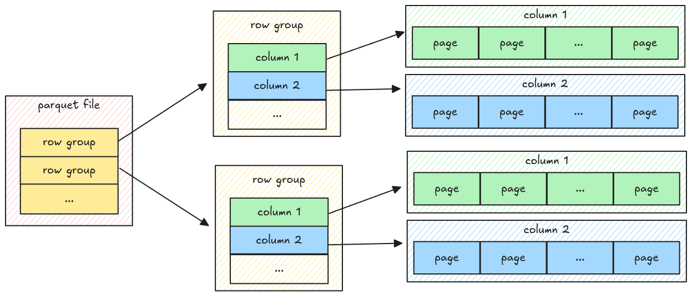

# Understand File Format

Before implementing further, let's look at the parquet file format and its file metadata.

A parquet file has multiple row groups; each row group has multiple columns; each column has
multiple pages, which contain the actual column data.

The data only exists at the page level, which means to parse all the data, the parser must go down
to the page level, get the data, and merge it back.
