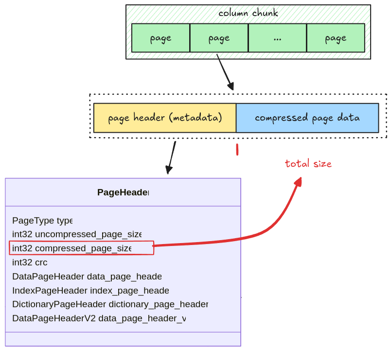
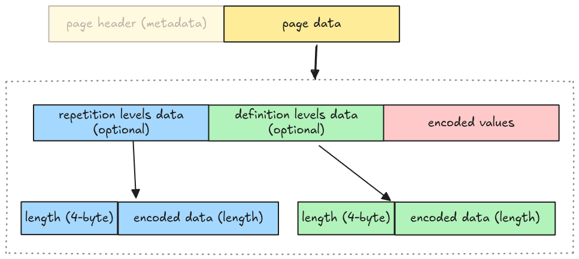
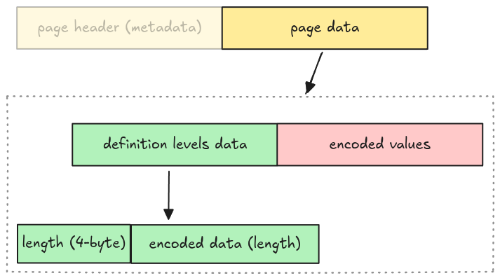

# Data Page

A parquet file can have
[multiple page types](https://parquet.apache.org/docs/file-format/metadata/#page-header), including
dictionary page, data page, index page; each serves different purposes. In this step, we handle the
data page, which stores the actual column data.

## Page Layout

A page has two parts: a header and a compressed page data. The total size of a page data can be
extracted by referring to the `compressed_page_size` field.



At the moment, all the page data is uncompressed. Page decompression will be handled later in the
[Compression section](./step14-compression.md).

> There are two types of data page: Version 1 and Version 2. To make the implementation simpler, all
> the data page is treated as version 1.

## Data Page Layout

A [data page](https://parquet.apache.org/docs/file-format/data-pages/) contains 3 pieces of
information:

- repetition levels data: the nested level of the current column, which is used to parse nested data
  types (i.e. array).
- definition levels data: the null map for columns having null data, more on this will be explained
  in [Definition Levels](./step13-01-definition-levels.md).
- encoded values: the actual column data.



Whether the repetition levels data and definition levels data are included is determined by walking
the file schema. To make the implementation simple, we omit this step and make some assumptions
below:

- No nested data types support: the repetition levels data isn't included.
- All columns may contain nulls: the definition levels data always exists.

Which means the actual data page layout for our parser is:



We represent this as an enum variant `Page::DataPage` in `src/page.rs` with 3 required fields
mentioned above.

```rust,ignore
pub enum Page {
    DataPage {
        page_header: PageHeader,
        definition_levels: Bytes,
        encoded_values: Bytes,
    },
    // ...
```

## Task

Implement the `read_page` function in `src/page.rs`. It takes a whole page data in `Bytes` and
returns a `Page`. (the `codec` argument is used for decompressing page in todo:section, you can
ignore this at the moment).

```rust,ignore
pub fn read_page(data: Bytes, codec: CompressionCodec) -> Result<(Page, Bytes)> {
    todo!("step03: read a single page data")
}
```

*The definition levels data doesn't make sense yet, so the test in this step doesn't verify whether
you get the definition levels data correctly. However, it will be checked in
[Definition Levels](./step13-01-definition-levels.md).*

## Test

Test case for this step is `step03_data_page`.

## Hints and Solution

<details>
  <summary>Hint (steps to read a page)</summary>

- read the page header
- read definition levels
- read encoded values

</details>

<details>
  <summary>Hint (how to read page header)</summary>

The page header is metadata, you can use `read_thrift_metadata::<PageHeader>`.

</details>

<details>
  <summary>Hint (how to parse definition levels data)</summary>

The definition levels contains 4-byte length, and its actual data. You can get the length first,
then the data. The tricky part is that the definition levels data needs to contain the length
itself.

```rust,ignore
// clone the data so that we don't advance the cursor
let length = data.clone().get_u32_le() as usize;
// get the data and its length
let definition_levels = data.slice(..length + 4);
```

</details>

<details>
  <summary>Solution</summary>

```rust,ignore
pub fn read_page(data: Bytes, codec: CompressionCodec) -> Result<(Page, Bytes)> {
    let (page_header, mut remaining) = read_thrift_metadata::<PageHeader>(data)?;
    let mut page_data = remaining.split_to(page_header.compressed_page_size as usize);

    let page = match page_header.type_ {
        PageType::DATA_PAGE => {
            // because the definition levels contains the length itself,
            // we need to clone the data to avoid shifting its bytes.
            let definition_levels_len = page_data.clone().get_u32_le() as usize;
            let definition_levels = page_data.split_to(definition_levels_len + 4);

            Page::DataPage {
                page_header,
                definition_levels,
                encoded_values: page_data,
            }
        }
        PageType::DICTIONARY_PAGE => {
            todo!("read_page: handle read dictionary page in `step11: dictionary page` section")
        }
        page_type => unimplemented!("read_page: unsupported {:?}", page_type),
    };

    Ok((page, remaining))
}
```

</details>
