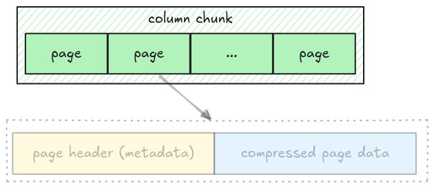
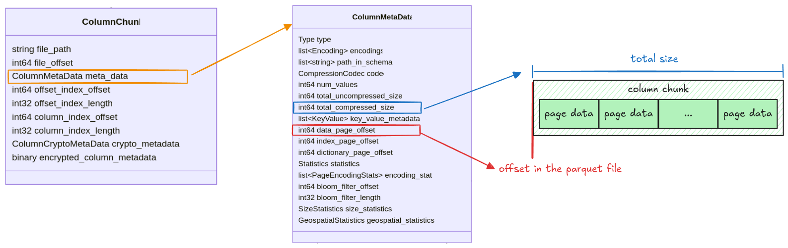

# Data Pages

As noted in the [Understand File Format](./step02-file-structure.md), a column has multiple pages,
all packed together. In this step, we will extract all pages for a given column chunk.



All information for getting column data is stored in the `ColumnMetaData`, which contains:

- `data_page_offset`: the offset of a column chunk in a parquet file
- `total_compressed_size`: the length of a column chunk data, this includes multiple pages packed
  together



Pages in a column chunk are represented as the `Pages` struct with 2 fields: `data_pages` and
`dictionary_page`. For this step, we only focus on the `data_pages`, the `dictionary_page` will be
handled later in the [Dictionary Page section](./step11-dictionary-page.md).

```rust,ignore
pub struct Pages {
    pub data_pages: Vec<Page>,
    pub dictionary_page: Option<Page>,
}
```

## Task

Implement the `read_pages` function in `src/page.rs`. It takes the entire file data as `Bytes` and
returns a `Pages` struct.

```rust,ignore
pub fn read_pages(data: Bytes, column_metadata: &ColumnMetaData) -> Result<Pages> {
    todo!("step04: read all pages for a given column chunk")
}
```

You should use the `read_page` function from the [previous step](./step03-data-page.md) and keep
extracting pages until there are none left.

## Test

Test case for this step is `step04_data_pages`.

## Hints and Solution

<details>
  <summary>Hint (how to get the raw column chunk bytes)</summary>

The column chunk's position and its length are stored in `data_page_offset` and
`total_compressed_size`. The raw bytes can be extracted like this:

```rust,ignore
let column_chunk_data = data.slice(data_page_offset..data_page_offset + total_compressed_size)
```

</details>

<details>
  <summary>Hint (how to extract all pages)</summary>

The `read_page` function returns the remaining bytes. Keep applying `read_page` until there are no
bytes left.

```rust,ignore
while !data.is_empty() {
    let (page, remaining) = read_page(/* ... */);
    data = remaining;
}
```

</details>

<details>
  <summary>Solution</summary>

```rust,ignore
pub fn read_pages(data: Bytes, column_metadata: &ColumnMetaData) -> Result<Pages> {
    let offset = column_metadata.data_page_offset as usize;
    let len = column_metadata.total_compressed_size as usize;

    let mut pages_bytes = data.slice(offset..offset + len);
    let mut data_pages = vec![];

    while !pages_bytes.is_empty() {
        let (page, remaining) = read_page(pages_bytes, column_metadata.codec)?;
        data_pages.push(page);
        pages_bytes = remaining;
    }

    Ok(Pages {
        data_pages,
        dictionary_page: None,
    })
}
```

</details>
