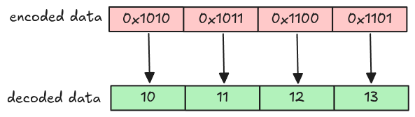

# Plain Decoder

We have all pages data for a single column chunk, but we can't extract the actual values out yet. As
mentioned in the [Overview](./overview.md), we need to decode the page data. This step tackles the
simplest one:
[Plain encoding](https://parquet.apache.org/docs/file-format/data-pages/encodings/#PLAIN).



In plain encoding, each value is encoded separately depending on the column data type. For our
parser, only these data types are supported (the Explanation part is copied from the
[spec](https://parquet.apache.org/docs/file-format/data-pages/encodings/#PLAIN)).

| Data type | Parquet type | Explanation                                                                  |
| --------- | ------------ | ---------------------------------------------------------------------------- |
| BOOLEAN   | BOOLEAN      | Bit packed, LSB first                                                        |
| INT32     | INT32        | 4 bytes little endian                                                        |
| INT64     | INT64        | 8 bytes little endian                                                        |
| FLOAT     | FLOAT        | 4 bytes IEEE little endian                                                   |
| DOUBLE    | DOUBLE       | 8 bytes IEEE little endian                                                   |
| STRING    | BYTE_ARRAY   | length in 4 bytes little endian followed by the bytes contained in the array |

To make it simple for implementation, we use
[polar's Scalar](https://docs.rs/polars/latest/polars/prelude/struct.Scalar.html) to represent the
decoded value. A `Scalar` can be created like this.

```rust,ignore
let scalar_integer = Scalar::from(1i32);
let scalar_string = Scalar::from(PlSmallStr::from_string("one"))
```

## Task

Implement two functions `plain_decode` in `src/decoder/plain.rs` and `decode_page` in
`src/decoder/mod.rs`.

### `plain_decode`

This function takes page's data in `Bytes` and returns the decoded vector of `Scalar` based on the
data type. (You don't need to implement the boolean data type, it requires different encoding which
will be covered in todo:section.)

```rust,ignore
pub fn plain_decode(
    encoded_data: Bytes,
    parquet_type: Type,
    num_values: usize,
) -> Result<Vec<Scalar>> {
    match parquet_type {
        Type::INT32 => todo!("step05: decode int32"),
        Type::INT64 => todo!("step05: decode int64"),
        Type::FLOAT => todo!("step05: decode float"),
        Type::DOUBLE => todo!("step05: decode double"),
        Type::BYTE_ARRAY => todo!("step05: decode string"),
        Type::BOOLEAN => todo!("step09: decode boolean"),
        _ => unimplemented!("plain_decode: unsupported data type {:?}", parquet_type),
    }
}
```

To avoid messing with unicode data, we assume all `BYTE_ARRAY` data can be converted to `String`
without error. In other words, this never panics.

```rust,ignore
String::from_utf8(data).unwrap()
```

### `decode_page`

This is a wrapper around all supported decoders, it checks page's encoding and applies the correct
decoder. You need to handle the `Encoding::PLAIN` arm in this step.

```rust,ignore
todo::copy
```

You can get the encoded values using `Page::encoded_values()` function.

## Test

Test case for this step is `step05_plain_decoder`.

## Hints and Solution

<details>
  <summary>Hint (how to decode non-string types)</summary>

Some functions from the [bytes crate docs](https://docs.rs/bytes/latest/bytes/index.html) are useful
to extract primitive types. The extracted value can be converted to `Scalar` using `Scalar::from`

```rust,ignore
let scalar = Scalar::from(data.get_i32_le());
```

</details>

<details>
  <summary>Hint (how to decode string type)</summary>

String uses a variable length, its first 4 bytes is the length and then the actual string value.

```rust,ignore
let length = data.get_u32_le() as usize;
let string = data.slice(..length)
```

The actual bytes value can then be converted to `String` using `String::from_utf8` and
`PlSmallStr::from_string`.

```rust,ignore
let string = String::from_utf8(data).unwrap();
Scalar::from(PlSmallStr::from_string(string))
```

</details>

<details>
  <summary>Solution</summary>

`plain_decode` function

```rust,ignore
pub fn plain_decode(
    encoded_data: Bytes,
    parquet_type: Type,
    num_values: usize,
) -> Result<Vec<Scalar>> {
    let mut encoded_data = encoded_data;
    let mut scalars = Vec::with_capacity(num_values);

    match parquet_type {
        Type::INT32 => {
            for _ in 0..num_values {
                scalars.push(Scalar::from(encoded_data.get_i32_le()))
            }
        }
        Type::INT64 => {
            for _ in 0..num_values {
                scalars.push(Scalar::from(encoded_data.get_i64_le()))
            }
        }
        Type::FLOAT => {
            for _ in 0..num_values {
                scalars.push(Scalar::from(encoded_data.get_f32_le()))
            }
        }
        Type::DOUBLE => {
            for _ in 0..num_values {
                scalars.push(Scalar::from(encoded_data.get_f64_le()))
            }
        }
        Type::BYTE_ARRAY => {
            for _ in 0..num_values {
                let size = encoded_data.get_u32_le() as usize;
                let string = String::from_utf8(encoded_data.split_to(size).to_vec())?;
                scalars.push(Scalar::from(PlSmallStr::from_string(string)))
            }
        }
        Type::BOOLEAN => todo!("step09: decode boolean"),
        _ => unimplemented!("plain_decode: unsupported data type {:?}", parquet_type),
    }

    Ok(scalars)
}
```

`decode_page` function

```rust,ignore
todo:section
```

</details>
