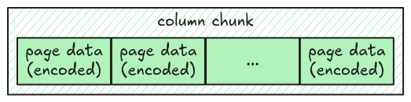

# Column

We know how to get all pages for a column chunk and how to decode an individual page. Now, let's put
all of them together and completely parse a column chunk.



We use [polars's Column](https://docs.rs/polars/latest/polars/prelude/enum.Column.html) to represent
a column in our parser. There is a helper function that converts a vector of `Scalar` into a
`Column` for you.

```rust,ignore
fn column_from_scalars(scalars: Vec<Scalar>, column_metadata: &ColumnMetaData) -> Result<Column> {
    let values: Vec<AnyValue<'_>> = scalars
        .into_iter()
        .map(|scalar| scalar.into_value())
        .collect();

    let column_name = column_metadata.path_in_schema.join(".");
    let series = Series::from_any_values(column_name.into(), &values, true)?;
    let column = Column::from(series);

    Ok(column)
}
```

## Task

Implement the `read_column` function in `src/column.rs`. It takes the whole file data in `Bytes` and
returns a `Column`.

```rust,ignore
pub fn read_column(data: Bytes, column_chunk: &ColumnChunk) -> Result<Column> {
    todo!("step06: implement read column")
}
```

## Test

Test case for this step is `step06_column`.

## Hints and Solution

<details>
  <summary>Hint (how to get the column metadata)</summary>

The column metadata is stored as `meta_data` field in a `ColumnChunk`.

```rust,ignore
column_chunk
    .meta_data
    .as_ref()
    .expect("read_column: missing column metadata");
```

</details>

<details>
  <summary>Hint (how to get the parquet data type)</summary>

The parquet data type can be retrieved from `column_metadata.type_`.

</details>

<details>
  <summary>Hint (how to get the number of values)</summary>

The number of values in a page can be retrieved using `Page::num_values()` function.

</details>

<details>
  <summary>Solution</summary>

```rust,ignore
pub fn read_column(data: Bytes, column_chunk: &ColumnChunk) -> Result<Column> {
    let column_metadata = column_chunk
        .meta_data
        .as_ref()
        .expect("read_column: missing column metadata");
    let pages = read_pages(data, column_metadata)?;
    let mut scalars = Vec::with_capacity(column_metadata.num_values as usize);
    for page in pages.data_pages {
        let decoded_scalars = decode_page(&page, column_metadata.type_, page.num_values())?;
        scalars.extend(decoded_scalars);
    }
    column_from_scalars(scalars, column_metadata)
}
```

</details>
