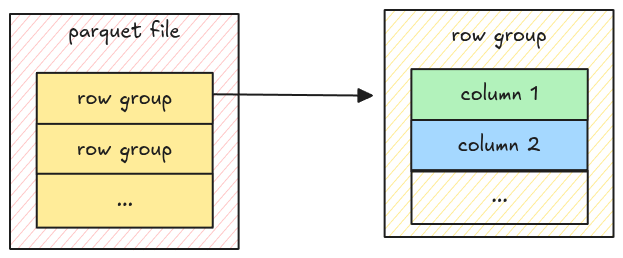
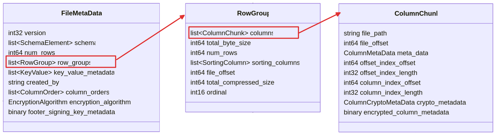

# Row Group

From the [Understand File Format section](./step02-file-structure.md#understand-file-format), we
know a parquet file has multiple row groups, each row group has multiple column chunks. In this
step, we will read all of them!



The relationship above looks like this from the
[metadata spec](https://parquet.apache.org/docs/file-format/metadata/#file-metadata).



As some of you might expect, to represent the data for a row group and a parquet file, we use
[Polars DataFrame](https://docs.rs/polars/latest/polars/frame/struct.DataFrame.html).

## Task

### `read_row_group`

Implement the `read_row_group` function in `scr/row_group.rs`. It takes the entire file data as
`Bytes` and returns a `DataFrame`.

```rust,ignore
pub fn read_row_group(data: Bytes, row_group: &RowGroup) -> Result<DataFrame> {
    todo!("step07: implement read row group")
}
```

You can use
[`DataFrame::new_infer_height`](https://docs.rs/polars/latest/polars/frame/struct.DataFrame.html#method.new_infer_height)
to group multiple columns together into a single `DataFrame`.

### `read_row_groups`

Implement the `read_row_groups` function in `src/row_group.rs`. It takes the entire file data as
`Bytes` and returns a `DataFrame`.

```rust,ignore
pub fn read_row_groups(data: Bytes, file_metadata: &FileMetaData) -> Result<DataFrame> {
    todo!("step07: implement read row groups")
}
```

You can use [concat](https://docs.rs/polars/latest/polars/prelude/fn.concat.html) to concatenate the
`DataFrame` from all groups into a single `DataFrame`.

## Test

Test case for this step is `step07_row_group`.

## Hints and Solution

<details>
  <summary>Hint (How to concatenate multiple data frames)</summary>

Convert the `DataFrame` into a `LazyFrame`, then use the
[`concat`](https://docs.rs/polars/latest/polars/prelude/fn.concat.html) function.

```rust,ignore
// convert `DataFrame` into `LazyFrame`
let lazyframes: Vec<LazyFrame> = dataframes.into_iter().map(|df| df.lazy()).collect();

// concatenate `LazyFrame` to a single `DataFrame`
concat(
    lazyframes,
    UnionArgs {
        strict: true,
        ..Default::default()
    },
)?
.collect()?;
```

</details>

<details>
  <summary>Solution</summary>

`read_row_group`:

```rust,ignore
pub fn read_row_group(data: Bytes, row_group: &RowGroup) -> Result<DataFrame> {
    let mut columns = Vec::with_capacity(row_group.columns.len());
    for column_chunk in &row_group.columns {
        let column = read_column(data.clone(), column_chunk)?;
        columns.push(column);
    }
    let df = DataFrame::new_infer_height(columns)?;
    Ok(df)
}
```

`read_row_groups`:

```rust,ignore
pub fn read_row_groups(data: Bytes, file_metadata: &FileMetaData) -> Result<DataFrame> {
    let mut dfs = Vec::with_capacity(file_metadata.row_groups.len());
    for row_group in &file_metadata.row_groups {
        let df = read_row_group(data.clone(), row_group)?;
        dfs.push(df.lazy());
    }
    let df = concat(
        dfs,
        UnionArgs {
            strict: true,
            ..Default::default()
        },
    )?
    .collect()?;
    Ok(df)
}
```

</details>
