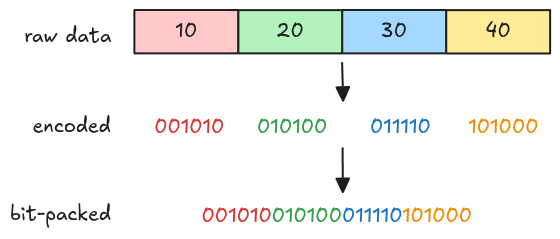
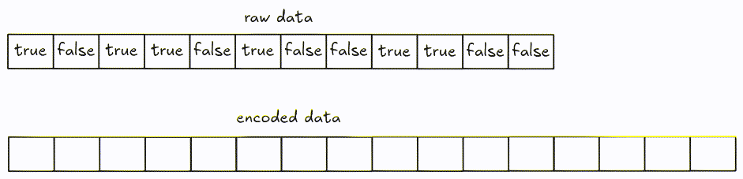
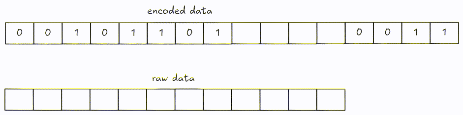

# Boolean data

Recall from the [Plain Decoder](./step05-plain-decoder.md) section, boolean data type is encoded
using
[bit-packed encoding](https://parquet.apache.org/docs/file-format/data-pages/encodings/#BITPACKED).

| Data type | Parquet type | Explanation           |
| --------- | ------------ | --------------------- |
| BOOLEAN   | BOOLEAN      | Bit packed, LSB first |

## Bit-packed encoding

The name bit-packed already implies what it does: encodes each value into bits (with the same
bit-width), then packs them together. Below is an example of encoding 10, 20, 30, 40 using 6
bit-width.



*The figure above just gives you a rough idea of how bit-packed works in general, it isn't exactly
what parquet bit-packed encoding does, we will look into this later in todo:section.*

## Parquet bit-packed encoding for boolean data

For boolean data, each value can be either `true` or `false`, so 1 bit-width is sufficient to encode
those. Using 1 bit-width makes encoding and decoding much easier because there are no values
crossing byte boundary.

*We will see how to decode data using arbitrary bit-width later in todo:section.*

### Encode

For encoding, every 8 bits are encoded into a group with LSB (Least Significant Bit) first, those
with fewer than 8 bits are padded with 0.



### Decode

Decoding can be performed by fetching 8 bits at a time and shifting it until there are no remaining
bits left (or if we get enough values).



> You can optimize this by decoding more than 8 bits at a time (i.e. 32 bits).

## Task

Implement the `bit_packed_decode` function in `src/decoder/bit_packed.rs`. For this task, you can be
sure that the data type is boolean, and bit-width is 1.

```rust,ignore
pub fn bit_packed_decode(
    encoded_data: Bytes,
    parquet_type: Type,
    bit_width: u8,
    num_values: usize,
) -> Result<Vec<Scalar>> {
    todo!("step09: implement the boolean data decoder")
}
```

You also need to handle the `Type::BOOLEAN` arm in `plain_decode`.

```rust,ignore
pub fn plain_decode(
    encoded_data: Bytes,
    parquet_type: Type,
    num_values: usize,
) -> Result<Vec<Scalar>> {
    match parquet_type {
        // ...
        Type::BOOLEAN => todo!("step09: decode boolean"),
        // ...
    }
}
```

## Test

Test case for this step is `step09_boolean_column`.

## Hints and Solution

<details>
    <summary>Hint (decoding steps)</summary>

- Fetch the data each 8 bits at a time. (You can optimize by reading 4 bytes at a time in little
  endian).
- Shift right until there are no bits left or until you get enough values.
- Create vector of boolean `Scalar`.

</details>

<details>
    <summary>Solution</summary>

`bit_packed_decode`:

```rust,ignore
pub fn bit_packed_decode(
    encoded_data: Bytes,
    parquet_type: Type,
    bit_width: u8,
    num_values: usize,
) -> Result<Vec<Scalar>> {
    let mut encoded_data = encoded_data;
    let mut needed = num_values;
    let mut scalars = Vec::with_capacity(num_values);
    while needed > 0 {
        let group = encoded_data.get_u8();
        for i in 0..needed.min(8) {
            scalars.push(Scalar::from(group >> i & 1 == 1));
        }
        needed = needed.saturating_sub(8);
    }
    Ok(scalars)
}
```

`plain_decode`:

```rust,ignore
pub fn plain_decode(
    encoded_data: Bytes,
    parquet_type: Type,
    num_values: usize,
) -> Result<Vec<Scalar>> {
    let mut encoded_data = encoded_data;
    let mut scalars = Vec::with_capacity(num_values);

    match parquet_type {
        // ...
        Type::BOOLEAN => scalars = bit_packed_decode(encoded_data, Type::BOOLEAN, 1, num_values)?,
        // ...
    }

    Ok(scalars)
}
```

</details>
