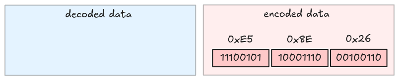
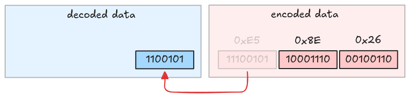
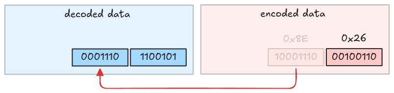
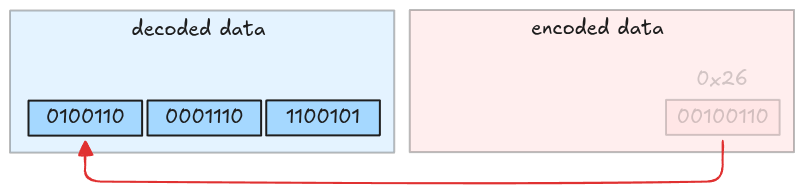

# Run header decoder (ULEB128 Decoder)

A run header is **an integer** encoded using
[ULEB-128 encoding](https://en.wikipedia.org/wiki/LEB128#Unsigned_LEB128), Wikipedia has a very
well-explained encoding example for 624485.

```text
MSB ------------------ LSB
      10011000011101100101  In raw binary
     010011000011101100101  Padded to a multiple of 7 bits
 0100110  0001110  1100101  Split into 7-bit groups
00100110 10001110 11100101  Add high 1 bits on all but last (most significant) group to form bytes
    0x26     0x8E     0xE5  In hexadecimal

→ 0xE5 0x8E 0x26            Output stream (LSB to MSB)
```

One important note is that the last byte has its MSB set to `0` instead of `1`; this signals the
decoder to stop fetching bytes when decoding data.

## Decode

Decoding is a reverse operation: it strips the MSB (Most Significant Bit) in each byte, and packs
them together. Let's visualize it.



Take the first byte and strip its MSB.



Take the second byte and strip its MSB.



Take the third byte and strip its MSB. This is also the last byte because its MSB is 0.



The decoded value is `010011000011101100101`, which is `624485`.

## Task

Implement the `uleb128_decode` function in `src/decoder/uleb128.rs`. It takes the encoded `Bytes`
and returns a decoded integer with the remaining bytes.

```rust,ignore
pub fn uleb128_decode(encoded_data: Bytes) -> Result<(u64, Bytes)> {
    todo!("step10-01: implement uleb128 decoder")
}
```

## Test

Test case for this step is `step10_01_uleb128_decoder`.

## Hints and Solution

<details>
  <summary>Hint</summary>

*There is no hint for this task.*

</details>

<details>
    <summary>Solution</summary>

```rust,ignore
pub fn uleb128_decode(encoded_data: Bytes) -> Result<(u64, Bytes)> {
    let mut encoded_data = encoded_data;
    let mut result = 0u64;

    let total_bytes = encoded_data.len();
    for i in 0..total_bytes {
        let byte = encoded_data.get_u8() as u64;
        result |= (byte & 0x7F) << (i * 7);
        // MSB = 0, stop
        if byte & 0x80 == 0 {
            return Ok((result, encoded_data));
        }
    }
    bail!("uleb128_decode: no byte with leading 0")
}
```

</details>
