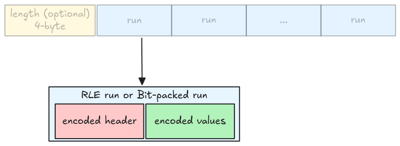
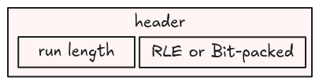
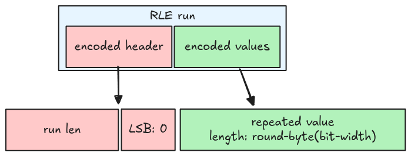
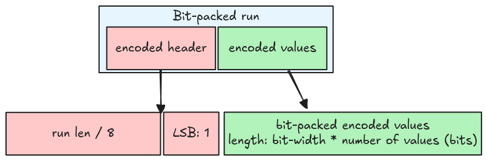

# Run

In this step, we will extract information for a single run, including a run header and its encoded
values.



## Run header

A run header is **an integer** containing 2 pieces of information:

- An indicator bit that tells us whether a run is an RLE run or a bit-packed run. This is stored in
  the LSB: 0 means RLE, 1 otherwise.
- The run length: determines how many values in the run. This is an integer represented using the
  remaining bits (without the LSB).



For example, if the run header is 13 (represented as `1101` in binary), then:

- LSB is 1, which is a bit-packed run
- Run length is 6 (`110` in binary)

## RLE run

From the [RLE encoding spec](https://parquet.apache.org/docs/file-format/data-pages/encodings/#RLE),
an RLE run has some properties:

- The LSB is 0
- The RLE run length (the number of values) equals the run length information in the header
- The repeated value is stored in the encoded data, using the *round up to the next byte bit-width*.
  For example, if the bit-width is 1, then it needs 1 byte; if the bit-width is 9, then it needs 2
  bytes.



## Bit-packed run

For a bit-packed run:

- The LSB is 1
- The bit-packed run length (the number of values) is the header's run length multiplied by 8.
- The values are encoded using bit-packed encoding, the total **bits** needed is the bit-width
  multiplied by the number of values.



> A bit-packed run stores a multiple of 8 values at a time, thus it might contain garbage. For
> example, if the bit-width is 1, and the number of values is 2, then the run stores 8 values (run
> length is 8), of which 6 are garbage.

## Code representation

A run is represented using an enum `RleBitPackedRun`. All members are the same as introduced in the
above sections.

```rust,ignore
pub enum RleBitPackedRun {
    Rle {
        run_len: usize,
        bit_width: u8,
        encoded_values: Bytes,
    },
    BitPacked {
        run_len: usize,
        bit_width: u8,
        encoded_values: Bytes,
    },
}
```

## Task

Implement the `read_rle_bit_packed_run` function in `src/decoder/rle_bit_packing_hybrid.rs`. It
takes the encoded page data (the packed multiple runs data) as `Bytes`, and returns a correct run
with the remaining bytes.

```rust,ignore
pub fn read_rle_bit_packed_run(
    encoded_data: Bytes,
    bit_width: u8,
) -> Result<(RleBitPackedRun, Bytes)> {
    todo!("step10-02: extract a single run")
}
```

Note that you only need to extract the encoded values in bytes, not decoding it.

## Test

Test case for this step is `step10_02_run`.

## Hints and Solution

<details>
    <summary>Hint (how to decode the header)</summary>

Use `uleb128_decode` function to extract the header.

</details>

<details>
    <summary>Hint (how to extract LSB and the run length)</summary>

```rust,ignore
let lsb = header & 1;
let length = header >> 1;
```

</details>

<details>
    <summary>Hint (how to extract RLE repeated value)</summary>

Calculate the bytes needed for the repeated value using the provided bit-width, then use this value
to extract the repeated value.

```rust,ignore
let needed_bytes = bit_width.div_ceil(8);
```

</details>

<details>
    <summary>Hint (how to extract bit-packed values)</summary>

Get the number of bytes needed for the run, then use this value to extract the encoded values.

```rust,ignore
let needed_bytes = run_len * bit_width / 8;
```

</details>

<details>
    <summary>Solution</summary>

```rust,ignore
pub fn read_rle_bit_packed_run(
    encoded_data: Bytes,
    bit_width: u8,
) -> Result<(RleBitPackedRun, Bytes)> {
    let (header, mut remaining) = uleb128_decode(encoded_data)?;
    let lsb = header & 1;
    let length = (header >> 1) as usize;

    let run = if lsb == 0 {
        let needed_bytes = bit_width.div_ceil(8) as usize;
        let encoded_values = remaining.split_to(needed_bytes);

        RleBitPackedRun::Rle {
            run_len: length,
            bit_width,
            encoded_values,
        }
    } else {
        let run_len = length * 8;
        let needed_bytes = run_len * bit_width as usize / 8;
        let encoded_values = remaining.split_to(needed_bytes);

        RleBitPackedRun::BitPacked {
            run_len,
            bit_width,
            encoded_values,
        }
    };

    Ok((run, remaining))
}
```

</details>
