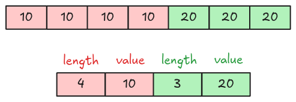

# RLE Decoder

Recall from the [RLE definition](./step10-rle-bit-packing-hybrid-decoder-boolean.md#rle), a RLE run
contains a run length and repeated value.



## Task

Implement the `rle_decode` function in `src/decoder/rle.rs`. It takes the encoded repeated value in
`Bytes` and returns the decoded vector of `Scalar`. For this task, the data type is always boolean
and the bit-width is 1.

```rust
pub fn rle_decode(
    encoded_data: Bytes,
    parquet_type: Type,
    bit_width: u8,
    num_values: usize,
) -> Result<Vec<Scalar>> {
    todo!("step10-03: implement rle decoder")
}
```

## Test

Test case for this step is `step10_03_rle_decoder`.

## Hints and Solution

<details>
    <summary>Hint</summary>

You can use the `bit_packed_decode` function to decode the repeated value.

</details>

<details>
    <summary>Solution</summary>

```rust,ignore
pub fn rle_decode(
    encoded_data: Bytes,
    parquet_type: Type,
    bit_width: u8,
    num_values: usize,
) -> Result<Vec<Scalar>> {
    let scalar = bit_packed_decode(encoded_data, parquet_type, bit_width, 1)?
        .pop()
        .with_context(|| "rle_decode: cannot get decoded scalar from `bit_packed_decode`")?;
    let scalars = vec![scalar; num_values];
    Ok(scalars)
}
```

</details>
