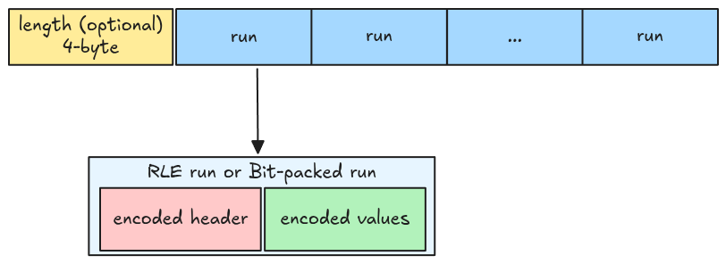

# RLE Bit-packing Hybrid Decoder

Until now, the parser can only read files with
[PLAIN Encoding](https://parquet.apache.org/docs/file-format/data-pages/encodings/#PLAIN). In the
upcoming tasks, we will handle
[RLE Bit-packing Hybrid Encoding](https://parquet.apache.org/docs/file-format/data-pages/encodings/#RLE),
this will be much more fun (and harder)!

From the spec, only these types of data are supported:

- Repetition and definition levels
- Dictionary indices
- Boolean values in data pages, as an alternative to PLAIN encoding

We will handle all of them eventually, but let's first go with the boolean values (because it is the
easiest).

## RLE

The [Boolean Data section](./step09-boolean-data.md#bit-packed-encoding) explains the bit-packed
encoding. For RLE (Run Length Encoding), the data is encoded using 2 pieces of information: the run
length and the repeated value. Below is an example of encoding 10, 10, 10, 10, 20, 20, 20.

## RLE Bit-packing Hybrid Encoding

RLE Bit-packing Hybrid encoded data contains a 4-byte length and multiple encoded runs written back
to back. A run can be either an RLE run or a bit-packed run, and contains two parts: a run header
and the encoded values (both are themselves encoded!).

## Implementation

For a rough implementation, we start by decoding an individual run header, then extracting all the
runs, and finally decoding all of them.
