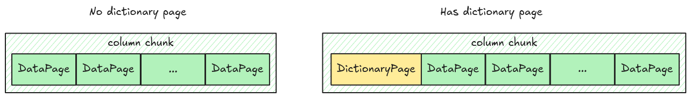

# Dictionary Page

Continue from [Data Page](./step03-data-page.md), this time we will handle a new type of page:
dictionary page, which will be used for
[Dictionary Encoding](https://parquet.apache.org/docs/file-format/data-pages/encodings/#DICTIONARY).

A dictionary page, if exists, will be placed at the first page in a column chunk. And there can be
at most one dictionary page per column chunk.



## Dictionary Page Layout

A dictionary page layout is very simple, just a header and the encoded values.


This is represented in code as an enum variant `Page::DictionaryPage` in `src/page.rs`.

```rust,ignore
pub enum Page {
    // ...
    DictionaryPage {
        page_header: PageHeader,
        encoded_values: Bytes,
    },
}
```

## Dictionary Page Position

The dictionary page position is stored in the `dictionary_page_offset` field in the
`ColumnMetaData`.


## Task

You will handle dictionary page in `read_page` and `read_pages` functions.

### `read_page`

You have probably implemented the `read_page` function in the
[Data Page's Task](./step03-data-page.md#task), make it work with `DictionaryPage`.

```rust,ignore
pub fn read_page(data: Bytes, codec: CompressionCodec) -> Result<(Page, Bytes)> {
    // ...
}
```

### `read_pages`

Make sure `read_pages` returns `Pages` containing `DictionaryPage` properly. You might find the
`Page::is_dictionary` helper function useful here.

```rust,ignore
pub fn read_pages(data: Bytes, column_metadata: &ColumnMetaData) -> Result<Pages> {
    // ...
}
```

## Test

Test case for this step is `step11_dictionary_page`.

## Hints and Solution

<details>
    <summary>Hint (how to get the page offset)</summary>

Use `dictionary_page_offset`, if it is None, take `data_page_offset` instead.

```rust,ignore
let offset = column_metadata
    .dictionary_page_offset
    .unwrap_or(column_metadata.data_page_offset) as usize;
```

</details>

<details>
  <summary>Solution</summary>

`read_page`:

```rust,ignore
pub fn read_page(data: Bytes, codec: CompressionCodec) -> Result<(Page, Bytes)> {
    let (page_header, mut remaining) = read_thrift_metadata::<PageHeader>(data)?;
    let mut page_data = remaining.split_to(page_header.compressed_page_size as usize);

    let page = match page_header.type_ {
        PageType::DATA_PAGE => {
            // because the definition levels contains the length itself,
            // we need to clone the data to avoid shifting its bytes.
            let definition_levels_len = page_data.clone().get_u32_le() as usize;
            let definition_levels = page_data.split_to(definition_levels_len + 4);

            Page::DataPage {
                page_header,
                definition_levels,
                encoded_values: page_data,
            }
        }
        PageType::DICTIONARY_PAGE => Page::DictionaryPage {
            page_header,
            encoded_values: page_data,
        },
        page_type => unimplemented!("read_page: unsupported {:?}", page_type),
    };

    Ok((page, remaining))
}
```

`read_pages`:

```rust,ignore
pub fn read_pages(data: Bytes, column_metadata: &ColumnMetaData) -> Result<Pages> {
    let offset = column_metadata
        .dictionary_page_offset
        .unwrap_or(column_metadata.data_page_offset) as usize;
    let len = column_metadata.total_compressed_size as usize;

    let mut pages_bytes = data.slice(offset..offset + len);
    let mut data_pages = vec![];
    let mut dictionary_page = None;

    while !pages_bytes.is_empty() {
        let (page, remaining) = read_page(pages_bytes, column_metadata.codec)?;
        if page.is_dictionary() {
            dictionary_page = Some(page);
        } else {
            data_pages.push(page);
        }
        pages_bytes = remaining;
    }

    Ok(Pages {
        data_pages,
        dictionary_page,
    })
}
```

</details>
