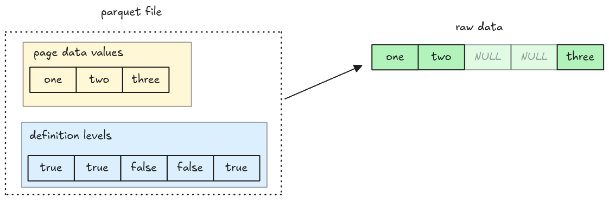

# Nulls

In the upcoming steps, we will handle
[columns with missing data (NULL)](https://parquet.apache.org/docs/file-format/nulls/). There are
two important notes:

- NULL values aren't encoded in the data page
- NULL information are stored in the definition levels

