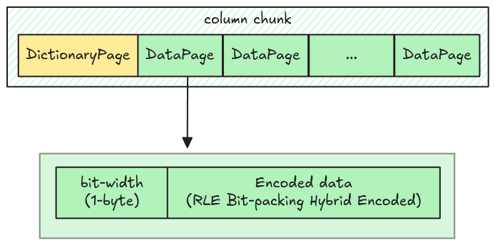

# Dictionary Decoder (two values)

Let's start with dictionary pages containing just 2 values. This means the data page only contains 0
and 1 indexes, which can be decoded using RLE Bit-packing encoding with 1 bit-width (which you have
already implemented).

## Data Page Layout

The data page layout in dictionary encoding is different from the normal data page layout. It
includes two parts:

- Bit-width: 1 byte
- Encoded data: RLE Bit-packing hybrid encoded (**No prepended length**)



## Task

You must implement two new functions in `src/decoder/dictionary.rs`, and use them to handle
dictionary encoding in `read_column` function.

For this task, the dictionary page is guaranteed to contain exactly two values (which means the
bit-width is always 1). You don't need to modify anything in the RLE Bit-packing hybrid decoder.

### `dictionary_decode`

Implement the `dictionary_decode` function in `src/decoder/dictionary.rs`. It decodes the data page
into the indexes.

```rust,ignore
pub fn dictionary_decode(encoded_data: Bytes, num_values: usize) -> Result<Vec<Scalar>> {
    todo!("step12: implement dictionary decoder")
}
```

### `decode_page`

Handle the `Encoding::RLE_DICTIONARY` arm in the `decode_page` function.

```rust,ignore
pub fn decode_page(page: &Page, parquet_type: Type, num_values: usize) -> Result<Vec<Scalar>> {
    match page.encoding() {
        // ...
        Encoding::RLE_DICTIONARY => todo!("step12-01: dictionary decoder"),
        // ...
    }
}
```

### `map_dictionary_entries`

Implement the `map_dictionary_entries` function in `src/decoder/dictionary.rs`. It takes dictionary
entries and the indexes, and returns the actual values.

```rust,ignore
pub fn map_dictionary_entries(
    dictionary_entries: &[Scalar],
    indexes: Vec<Scalar>,
) -> Result<Vec<Scalar>> {
    todo!("step12-01: implement dictionary decoder for two values")
}
```

### `read_column`

Handle dictionary page in `read_column`, you must decode the dictionary page, then map the indexes
from data page into correct values.

```rust,ignore
pub fn read_column(data: Bytes, column_chunk: &ColumnChunk) -> Result<Column> {
    // ...
}
```

## Test

Test case for this step is `step12_01_dictionary_decoder_two_values`.

## Hints and Solution

<details>
  <summary>Hint (how to decode data page)</summary>

To decode the data page in `dictionary_decode`, you need to get the `bit_width`, this is the first
byte in the encoded data.

```rust,ignore
let bit_width = encoded_data.get_u8();
```

Then call the `rle_bit_packing_hybrid_decode` function (the `prepended_length` should be `false`).

</details>

<details>
  <summary>Hint (how to map the entries)</summary>

Traverse through the indexes, convert them to integer and perform the look up from the dictionary
entries.

```rust,ignore
for index in indexes {
    let index = index.into_value().try_extract::<i32>()? as usize;
    // look up in the entries using the index
}
```

</details>

<details>
  <summary>Hint (how to extract the dictionary entries)</summary>

The dictionary entries are encoded using plain encoding in the dictionary page.

```rust,ignore
let dictionary_entries = decode_page(dictionary_page, column_metadata.type_, dictionary_page.num_values())?;
```

</details>

<details>
  <summary>Solution</summary>

`dictionary_decode`:

```rust,ignore
pub fn dictionary_decode(encoded_data: Bytes, num_values: usize) -> Result<Vec<Scalar>> {
    let mut encoded_data = encoded_data;
    let bit_width = encoded_data.get_u8();
    rle_bit_packing_hybrid_decode(encoded_data, Type::INT32, bit_width, num_values, false)
}
```

`decode_page`:

```rust,ignore
pub fn decode_page(page: &Page, parquet_type: Type, num_values: usize) -> Result<Vec<Scalar>> {
    match page.encoding() {
        // ...
        Encoding::RLE_DICTIONARY => dictionary_decode(page.encoded_values(), num_values),
        // ...
    }
}
```

`map_dictionary_entries`:

```rust,ignore
pub fn map_dictionary_entries(
    dictionary_entries: &[Scalar],
    indexes: Vec<Scalar>,
) -> Result<Vec<Scalar>> {
    let mut scalars = Vec::with_capacity(indexes.len());
    for index in indexes {
        let index = index.into_value().try_extract::<i32>()? as usize;
        let scalar = dictionary_entries[index].clone();
        scalars.push(scalar)
    }
    Ok(scalars)
}
```

`read_column`:

```rust,ignore
pub fn read_column(data: Bytes, column_chunk: &ColumnChunk) -> Result<Column> {
    let column_metadata = column_chunk
        .meta_data
        .as_ref()
        .expect("read_column: missing column metadata");
    let pages = read_pages(data, column_metadata)?;

    let dictionary_entries = match &pages.dictionary_page {
        Some(page) => {
            let dictionary_entries = decode_page(page, column_metadata.type_, page.num_values())?;
            Some(dictionary_entries)
        }
        None => None,
    };

    let mut scalars = Vec::with_capacity(column_metadata.num_values as usize);
    for page in pages.data_pages {
        let indexes_or_values = decode_page(&page, column_metadata.type_, page.num_values())?;
        let decoded_scalars = match &dictionary_entries {
            Some(dictionary_entries) => {
                map_dictionary_entries(dictionary_entries, indexes_or_values)?
            }
            None => indexes_or_values,
        };
        scalars.extend(decoded_scalars);
    }
    column_from_scalars(scalars, column_metadata)
}
```

</details>
