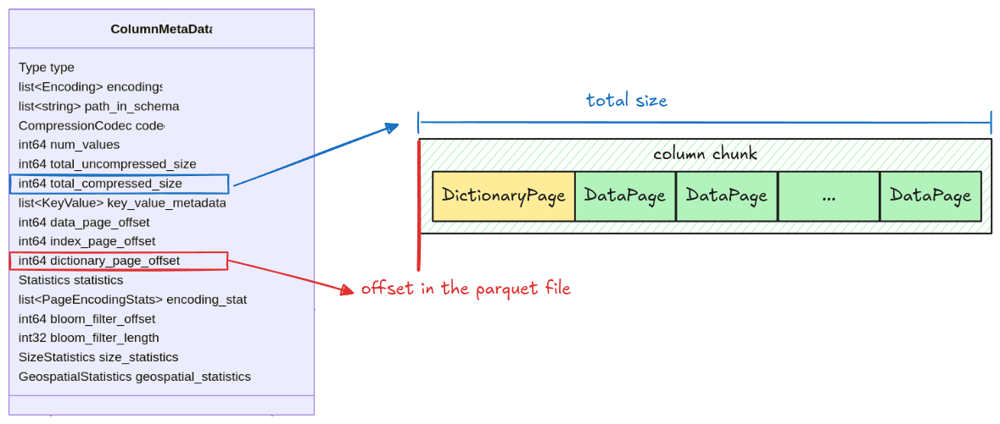
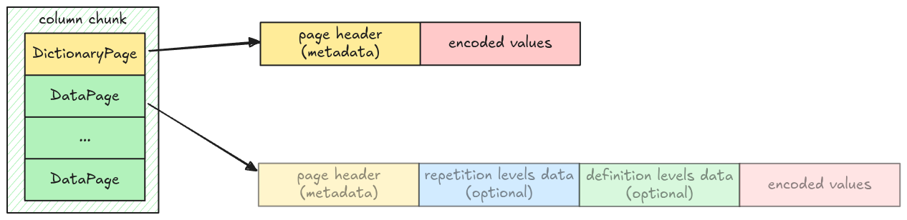

# Dictionary Page

The dictionary page, if exists, will be placed at the first page in a column chunk. Its position is
stored in the `dictionary_page_offset` field in the column metadata.



## Dictionary Page Layout

Unlike [Data Page Layout](./step03-data-page.md#data-page-layout), the dictionary page layout is
very simple, just a header with encoded values.



This is represented in code as an enum variant `Page::DictionaryPage` in `src/page.rs`.

```rust,ignore
pub enum Page {
    // ...
    DictionaryPage {
        page_header: PageHeader,
        encoded_values: Bytes,
    },
}
```

A column might or might not contain a dictionary page, which is represented as an optional field
`dictionary_page` in `Pages`:

```rust,ignore
pub struct Pages {
    pub data_pages: Vec<Page>,
    pub dictionary_page: Option<Page>,
}
```

## Dictionary Page Decoder

The dictionary page can be decoded using [Plain decoder](./step05-plain-decoder.md). The decoded
result is a vector of entries, which data pages can refer to using value's indexes.

## Task

### `read_page`

Update the `read_page` function in `src/page.rs`, make it work with `Page::DictionaryPage`.

```rust,ignore
pub fn read_page(data: Bytes, codec: CompressionCodec) -> Result<(Page, Bytes)> {
    // ...
}
```

### `read_pages`

Update the `read_pages` function in `src/page.rs`, make it work when there is a dictionary page. You
might find the `Page::is_dictionary()` helper function useful.

```rust,ignore
pub fn read_pages(data: Bytes, column_metadata: &ColumnMetaData) -> Result<Pages> {
    // ...
}
```

### `dictionary_entries`

Implement the `dictionary_entries` function in `src/dictionary.rs`. It takes a `Pages` and returns a
decoded dictionary entries as a vector of `Scalar` if exists.

```rust,ignore
pub fn dictionary_entries(pages: &Pages, parquet_type: Type) -> Result<Option<Vec<Scalar>>> {
    todo!("step12-01: extract dictionary entries from dictionary page")
}
```

## Test

Test case for this step is `step12_01_dictionary_page`.

## Hints and Solution

<details>
    <summary>Hint (how to get the correct page offset)</summary>

Use `dictionary_page_offset`, if it is None, take `data_page_offset` instead.

```rust,ignore
let offset = column_metadata
    .dictionary_page_offset
    .unwrap_or(column_metadata.data_page_offset) as usize;
```

</details>

<details>
  <summary>Solution</summary>

`read_page`:

```rust,ignore
pub fn read_page(data: Bytes, codec: CompressionCodec) -> Result<(Page, Bytes)> {
    // ...
    let page = match page_header.type_ {
        // ...
        PageType::DICTIONARY_PAGE => Page::DictionaryPage {
            page_header,
            encoded_values: page_data,
        },
      // ...
}
```

`read_pages`:

```rust,ignore
pub fn read_pages(data: Bytes, column_metadata: &ColumnMetaData) -> Result<Pages> {
    let offset = column_metadata
        .dictionary_page_offset
        .unwrap_or(column_metadata.data_page_offset) as usize;
    let len = column_metadata.total_compressed_size as usize;

    let mut pages_bytes = data.slice(offset..offset + len);
    let mut data_pages = vec![];
    let mut dictionary_page = None;

    while !pages_bytes.is_empty() {
        let (page, remaining) = read_page(pages_bytes, column_metadata.codec)?;
        if page.is_dictionary() {
            dictionary_page = Some(page);
        } else {
            data_pages.push(page);
        }
        pages_bytes = remaining;
    }

    Ok(Pages {
        data_pages,
        dictionary_page,
    })
}
```

`dictionary_entries`:

```rust,ignore
pub fn dictionary_entries(pages: &Pages, parquet_type: Type) -> Result<Option<Vec<Scalar>>> {
    let dictionary_entries = match &pages.dictionary_page {
        Some(page) => {
            let dictionary_entries = decode_page(page, parquet_type, page.num_values())?;
            Some(dictionary_entries)
        }
        None => None,
    };
    Ok(dictionary_entries)
}
```

</details>
