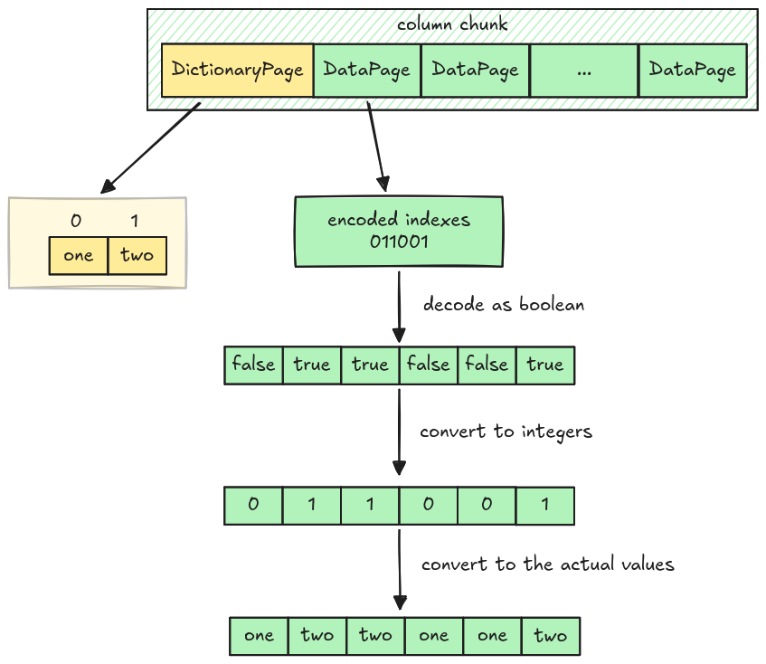

# Dictionary Decoder (two values)

The current RLE Bit-packing Hybrid decoder, which can only decode boolean values, cannot completely
decode data pages containing integer indexes in dictionary encoding.

However, we can make it work for an edge case: Columns with only two unique values. Because data
pages only require 0 and 1 and their indexes, they can be decoded as boolean and converted to
integers. (`false` for 0 and `true` for 1).



## Data Page Layout in Dictionary Encoding

The data page layout in dictionary encoding is different from
[normal Data Page Layout](./step03-data-page.md#data-page-layout). It only has two parts:

- Bit-width: 1 byte
- Encoded data: RLE Bit-packing hybrid encoded data (**No prepended length**)


Parquet uses `RLE_DICTIONARY` as the encoding name to distinguish it from the `RLE` used in normal
data pages.

## Task

### `dictionary_decode`

Implement the `dictionary_decode` function in `src/decoder/dictionary.rs`. It decodes a data page
into vector of `Scalar` containing indexes.

```rust,ignore
pub fn dictionary_decode(encoded_data: Bytes, num_values: usize) -> Result<Vec<Scalar>> {
    todo!("step12-02: dictionary decoder")
}
```

### `decode_page`

Update the `decode_page` function in `src/decoder/mod.rs` to handle the `Encoding::RLE_DICTIONARY`
arm.

```rust,ignore
pub fn decode_page(page: &Page, parquet_type: Type, num_values: usize) -> Result<Vec<Scalar>> {
    match page.encoding() {
        // ...
        Encoding::RLE_DICTIONARY => todo!("step12-02: dictionary decoder"),
        // ...
    }
}
```

### `map_dictionary_entries`

Implement the `map_dictionary_entries` function in `src/dictionary.rs`. It takes a dictionary
entries, the value's indexes, and returns the actual column values. Since the dictionary page might
or might not exist for a given column chunk, the dictionary entries is passed as an optional
argument.

```rust,ignore
pub fn map_dictionary_entries(
    dictionary_entries: &Option<Vec<Scalar>>,
    indexes_or_values: Vec<Scalar>,
) -> Result<Vec<Scalar>> {
    todo!("step12-02: map indexes in data page to the exact values")
}
```

### `read_column`

Handle dictionary page in the `read_column` in `src/column.rs`. It must extract the dictionary
entries and map with indexes from data pages.

```rust,ignore
pub fn read_column(data: Bytes, column_chunk: &ColumnChunk) -> Result<Column> {
    // ...
}
```

## Test

Test case for this step is `step12_02_dictionary_decoder_two_values`.

## Hints and Solution

<details>
  <summary>Hint (how to decode data page in dictionary encoding)</summary>

First, extract the bit-width from the encoded data, then call the `rle_bit_packing_hybrid_decode`.
You can convert the decoded data to integer right here, or cast them later in
`map_dictionary_entries`.

</details>

<details>
  <summary>Hint (how to map the entries)</summary>

Traverse through the indexes, convert them to integer and perform the look up from the dictionary
entries.

```rust,ignore
for index in indexes {
    let index = index.into_value().try_extract::<i32>()? as usize;
    // look up in the entries using the index
}
```

</details>

<details>
  <summary>Hint (how to get the column type for a dictionary page)</summary>

The column type for a dictionary page is the exact type in the column metadata.

</details>

<details>
  <summary>Solution</summary>

`dictionary_decode`:

```rust,ignore
pub fn dictionary_decode(encoded_data: Bytes, num_values: usize) -> Result<Vec<Scalar>> {
    let mut encoded_data = encoded_data;
    let bit_width = encoded_data.get_u8();
    rle_bit_packing_hybrid_decode(encoded_data, Type::INT32, bit_width, num_values, false)
}
```

`decode_page`:

```rust,ignore
pub fn decode_page(page: &Page, parquet_type: Type, num_values: usize) -> Result<Vec<Scalar>> {
    match page.encoding() {
        // ...
        Encoding::RLE_DICTIONARY => dictionary_decode(page.encoded_values(), num_values),
        // ...
}
```

`map_dictionary_entries`:

```rust,ignore
pub fn map_dictionary_entries(
    dictionary_entries: &Option<Vec<Scalar>>,
    indexes_or_values: Vec<Scalar>,
) -> Result<Vec<Scalar>> {
    let Some(dictionary_entries) = dictionary_entries else {
        return Ok(indexes_or_values);
    };
    let mut scalars = Vec::with_capacity(indexes_or_values.len());
    for index in indexes_or_values {
        let index = index.into_value().try_extract::<i32>()? as usize;
        let scalar = dictionary_entries[index].clone();
        scalars.push(scalar)
    }
    Ok(scalars)
}
```

`read_column`:

```rust,ignore
pub fn read_column(data: Bytes, column_chunk: &ColumnChunk) -> Result<Column> {
    // ...
    let pages = read_pages(data, column_metadata)?;
    let dictionary_entries = dictionary_entries(&pages, column_metadata.type_)?;
    // ...
    for page in pages.data_pages {
        // ...
        let num_values = is_present.iter().filter(|v| **v).count();

        let indexes_or_values = decode_page(&page, column_metadata.type_, num_values)?;
        let decoded_scalars = map_dictionary_entries(&dictionary_entries, indexes_or_values)?;
        // ...
}
```

</details>
