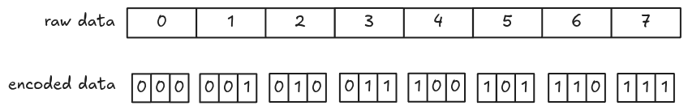
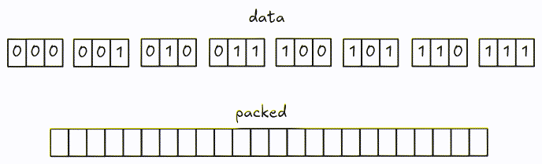
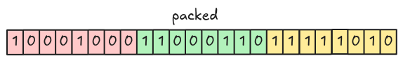
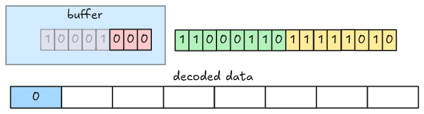
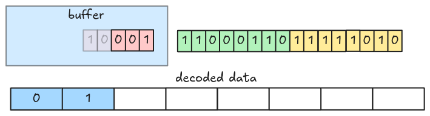
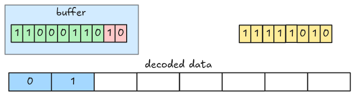
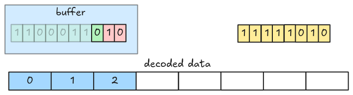
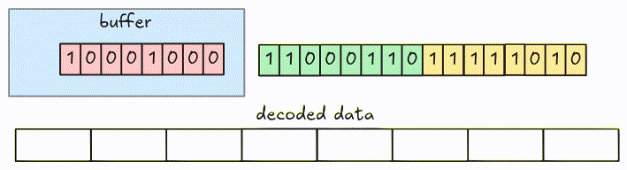

# Bit-packed arbitrary bit-width

We have implemented the dictionary decoder with 2 values and 1 value. Let's make it work with an
arbitrary number of unique values. To do that, the parser must be able to decode the RLE Bit-packing
hybrid encoded data with arbitrary bit-width. One important note is that we only need to handle 2
data types: Boolean and Integer (`INT32`).

This step focuses on Bit-packed encoding; the next step handles RLE.

## Encode

Encoding is pretty similar to [1-bit width](./step09-boolean-data.html#encode). Let's visualize it
using the
[example from the spec](https://parquet.apache.org/docs/file-format/data-pages/encodings/#RLE) with
3-bit width.



Encoded data is packed into 8-bit groups.



## Decode

Similar to [1-bit width](./step09-boolean-data.md#decode), we can fetch 8-bit group at a time and
decode them. However, with an arbitrary bit-width, the encoded value might span across group
boundaries. We can handle this by fetching groups into a buffer and keeping track of how many bits
it contains.

Let's see an example. This is the packed data with 3-bit width.



At the beginning, the decoder fetches the first 8-bit group into the buffer and decodes the first 3
bits (LSB).



Then the next 3 bits.



Now, the buffer only has 2 bits (this value spans a group boundary). The decoder needs to fetch the
next group from the packed encoded data.



And decodes the next 3 bits.



This is the full animation:



> The algorithm can be optimized by fetching more than 8-bit at a time.

## Task

Update the `bit_packed_decode` function in `src/decoder/bit_packed.rs` to handle arbitrary
bit-width.

```rust,ignore
pub fn bit_packed_decode(
    encoded_data: Bytes,
    parquet_type: Type,
    bit_width: u8,
    num_values: usize,
) -> Result<Vec<Scalar>> {
    // ...
}
```

There are only two data types we need to handle: `Type::BOOLEAN` and `Type::INT32`.

## Test

Test case for this step is `step12_03_dictionary_decoder_bit_packed`.

## Hints and Solution

<details>
  <summary>Hint (how to fetch groups)</summary>

Groups should be fetched to the left of the buffer.

```rust,ignore
let group = encoded_data.get_u8() as u64;
buffer |= group << buffer_bits;
```

</details>

<details>
  <summary>Hint (how to extract values out of the buffer)</summary>

A single value can be extracted using bit-and with the bit-width mask.

```rust,ignore
let mask = u64::MAX >> (64 - bit_width);
let value = buffer & mask;
```

</details>

<details>
  <summary>Solution</summary>

```rust,ignore
pub fn bit_packed_decode(
    encoded_data: Bytes,
    parquet_type: Type,
    bit_width: u8,
    num_values: usize,
) -> Result<Vec<Scalar>> {
    let mut encoded_data = encoded_data;
    let mut scalars = Vec::with_capacity(num_values);

    let mask = u64::MAX >> (64 - bit_width);
    let mut buffer = 0;
    let mut buffer_bits = 0;

    while scalars.len() < num_values {
        // Buffer needs more bits
        while buffer_bits < bit_width {
            let group = encoded_data.get_u8() as u64;
            // put the group data to the left of the current buffer
            buffer |= group << buffer_bits;
            buffer_bits += 8;
        }

        let scalar = match parquet_type {
            Type::BOOLEAN => Scalar::from(buffer & 1 == 1),
            Type::INT32 => Scalar::from((buffer & mask) as i32),
            _ => unimplemented!("bit_packed_decode: unsupported type: {:?}", parquet_type),
        };
        scalars.push(scalar);

        buffer = buffer.checked_shr(bit_width as u32).unwrap_or(0);
        buffer_bits -= bit_width;
    }

    Ok(scalars)
}
```

</details>
