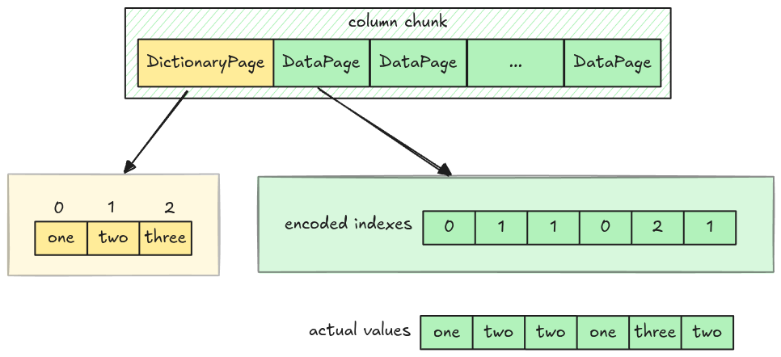

# Dictionary Decoder

In the upcoming tasks, we use the [Dictionary Page](./step11-dictionary-page.md) and implement the
[Dictionary Encoding](https://parquet.apache.org/docs/file-format/data-pages/encodings/#DICTIONARY).

## Dictionary Encoding

The dictionary encoding stores data into two places:

- Dictionary page: stores the actual values using [Plain Encoding](./step05-plain-decoder.md).
- Data page: stores the value's indexes using
  [RLE Bit-packing Hybrid Encoding](./step10-rle-bit-packing-hybrid-decoder-boolean.md). To
  distinguish with the RLE Bit-packing for boolean columns, parquet puts `RLE_DICTIONARY` as the
  encoding method for these data pages.

For the dictionary decoder, our main focus is the data page with RLE Bit-packing Hybrid Encoding.
This time, we will make it work with arbitrary bit-width!
