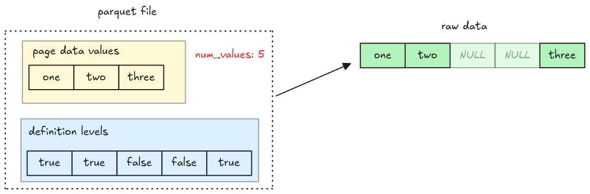

# Nulls Decoder

Now we have the null maps, we should be able to add missing entries to our columns. One thing to
note that the data page does not encode missing entries (even though `num_values` still refer to the
total values in a page).



## Task

You will implement the function to add null values to a column and apply it to correctly read column
containing null entries.

### `add_nulls_entries`

Implement the `add_nulls_entries` function in `src/nulls.rs`. This takes a null maps, a decoded
scalars from a data page and return a vector of `Scalar` containing null entries.

```rust,ignore
pub fn add_nulls_entries(
    is_present: &[bool],
    scalars: Vec<Scalar>,
    parquet_type: Type,
) -> Result<Vec<Scalar>> {
    todo!("step13-02: handle nulls in a column")
}
```

### `read_column`

Update `read_column` to add null entries to column. You should extract the null maps, and add
missing values to the column (you must correctly handle the number of values when decoding a page).

```rust,ignore
pub fn read_column(data: Bytes, column_chunk: &ColumnChunk) -> Result<Column> {
    // ...
}
```

## Test

Test case for this step is `step13_02_nulls_decoder`.

## Hints and Solution

<details>
  <summary>Solution</summary>

`add_nulls_entries`:

```rust,ignore
pub fn add_nulls_entries(
    is_present: &[bool],
    scalars: Vec<Scalar>,
    parquet_type: Type,
) -> Result<Vec<Scalar>> {
    let mut scalars = scalars;
    scalars.reverse();

    let mut result = Vec::with_capacity(is_present.len());
    for present in is_present {
        if *present {
            result.push(scalars.pop().with_context(
                || "add_nulls_entries: scalars is empty! the nulls map isn't correct",
            )?);
        } else {
            result.push(Scalar::null(parquet_to_polars_type(parquet_type)))
        }
    }

    Ok(result)
}
```

`read_column`:

```rust,ignore
pub fn read_column(data: Bytes, column_chunk: &ColumnChunk) -> Result<Column> {
    // ...

    let mut scalars = Vec::with_capacity(column_metadata.num_values as usize);
    for page in pages.data_pages {
        let is_present = decode_definition_levels(&page)?;
        let num_values = is_present.iter().filter(|v| **v).count();

        let indexes_or_values = decode_page(&page, column_metadata.type_, num_values)?;
        let decoded_scalars = match &dictionary_entries {
            Some(dictionary_entries) => {
                map_dictionary_entries(dictionary_entries, indexes_or_values)?
            }
            None => indexes_or_values,
        };
        let decoded_scalars =
            add_nulls_entries(&is_present, decoded_scalars, column_metadata.type_)?;
        scalars.extend(decoded_scalars);
    }
    column_from_scalars(scalars, column_metadata)
}
```

</details>
