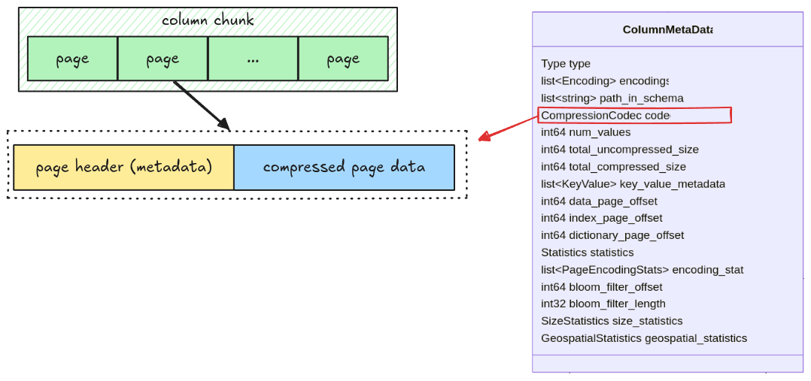

# Compression

Pages in a parquet file might be compressed. That information is stored in the column metadata's
codec field.



There are
[many codecs listed up from the spec](https://parquet.apache.org/docs/file-format/data-pages/compression/),
however, our parser will only support
[SNAPPY](https://parquet.apache.org/docs/file-format/data-pages/compression/#snappy).

## Task

You need to implement a new function for decompress page data, and then apply it when reading a
page.

### `decompress`

Implement the `decompress` function in `src/compression.rs`.

```rust,ignore
pub fn decompress(compressed_data: Bytes, codec: CompressionCodec) -> Result<Bytes> {
    match codec {
        CompressionCodec::UNCOMPRESSED => todo!("step14: implement compression"),
        CompressionCodec::SNAPPY => todo!("step14: implement compression"),
        _ => unimplemented!("Unsupported codec: {}", codec.0),
    }
}
```

### `read_page`

Update the `read_page` function to decompress a compressed page data. For snappy decompression,
refer to to [snap crate](https://docs.rs/snap/latest/snap/).

```rust,ignore
pub fn read_page(data: Bytes, codec: CompressionCodec) -> Result<(Page, Bytes)> {
    // ...
}
```

## Test

Test case for this step is `step14_compression`.

## Hints and Solution

<details>
  <summary>Hint (how to handle uncompressed data)</summary>

For uncompressed data, you don't need to do anything, just return it directly in the `decompress`
function.

</details>

<details>
  <summary>Hint (how to handle snappy compression)</summary>

For snappy compression, you can decompress it with
[decompress_vec](https://docs.rs/snap/latest/snap/raw/struct.Decoder.html#method.decompress_vec).

</details>

<details>
  <summary>Solution</summary>

`decompress`:

```rust,ignore
pub fn decompress(compressed_data: Bytes, codec: CompressionCodec) -> Result<Bytes> {
    match codec {
        CompressionCodec::UNCOMPRESSED => Ok(compressed_data),
        CompressionCodec::SNAPPY => {
            let mut decompressor = snap::raw::Decoder::new();
            let buf = decompressor.decompress_vec(compressed_data.as_ref())?;
            Ok(Bytes::from(buf))
        }
        _ => unimplemented!("Unsupported codec: {}", codec.0),
    }
}
```

`read_page`:

```rust,ignore
pub fn read_page(data: Bytes, codec: CompressionCodec) -> Result<(Page, Bytes)> {
    let (page_header, mut remaining) = read_thrift_metadata::<PageHeader>(data)?;
    let page_data = remaining.split_to(page_header.compressed_page_size as usize);
    let mut page_data = decompress(page_data, codec)?;
    let page = match page_header.type_ {
        // ...
    };
    Ok((page, remaining))
}
```

</details>
